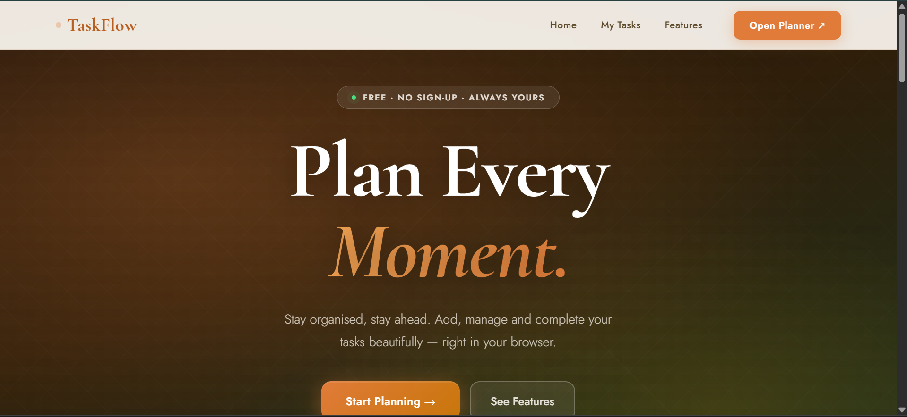
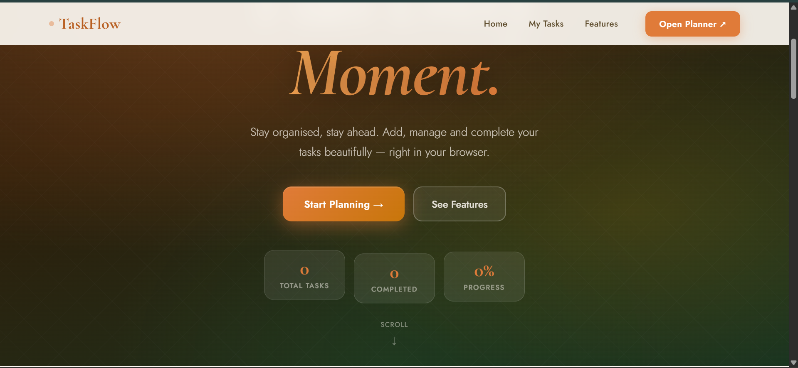
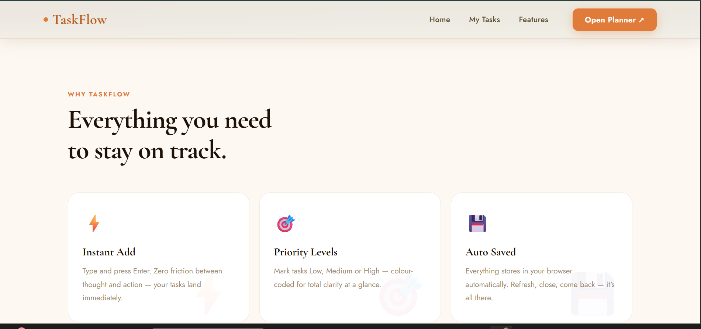
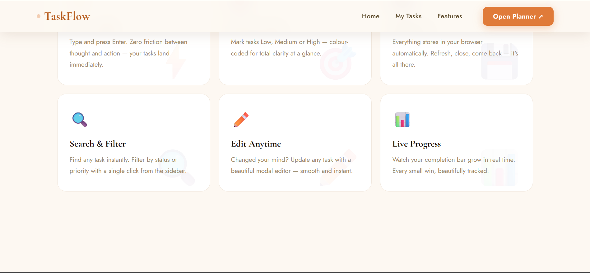
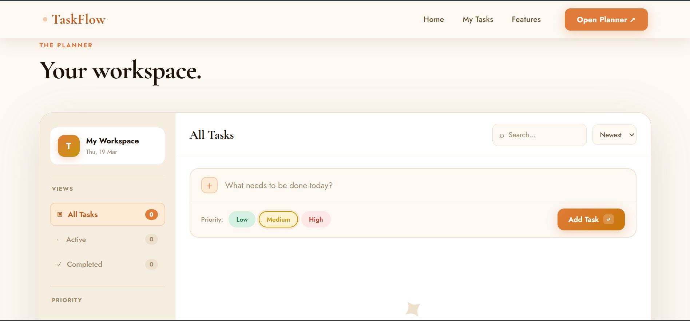
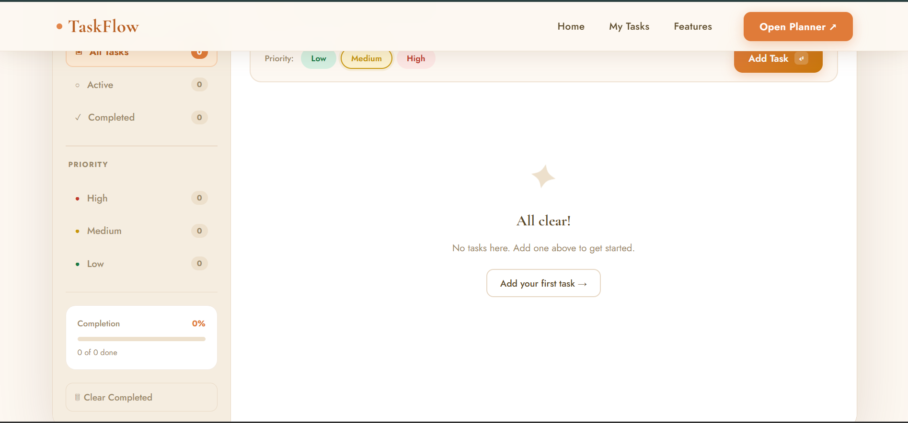
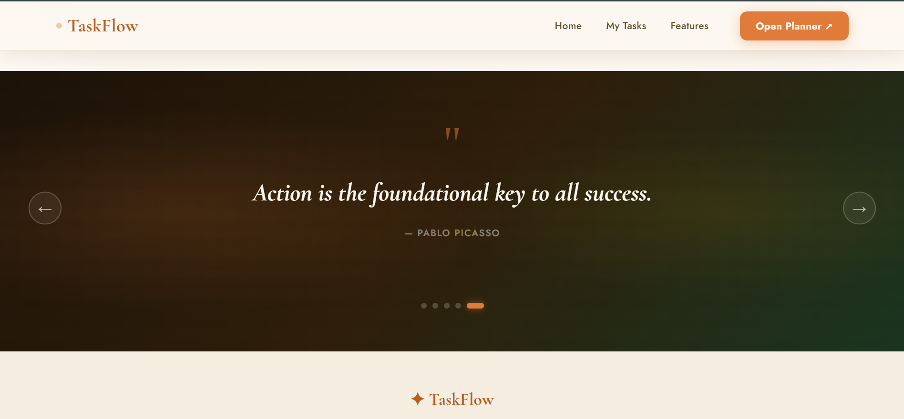
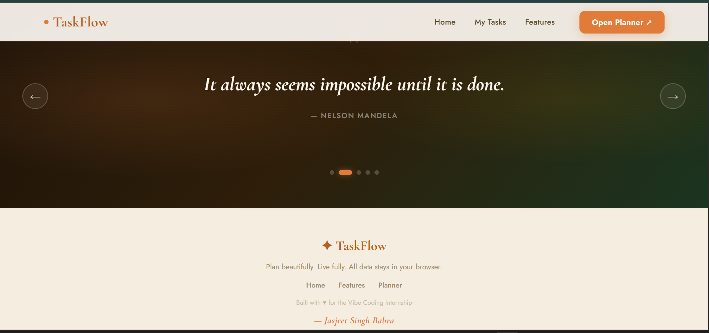

# ✦ TaskFlow — Organise Your Journey

> *"The secret of getting ahead is getting started."* — Mark Twain

A beautifully designed, fully functional **Task Manager Web App** built as a rapid prototype for the **Vibe Coding Internship** assignment. TaskFlow combines elegant UI inspired by India's rich cultural aesthetic with powerful productivity features — all running entirely in the browser with zero setup.

---

## 🌐 Live Preview

🔗 **Live Site:** [taskflow-jasjeet.vercel.app](https://taskflow-jasjeet.vercel.app)

🔗 **GitHub Repo:** [github.com/jsingh1609/TEN-internship](https://github.com/jsingh1609/TEN-internship/tree/main/task-2-rapid_prototype_webapp)

---

## 📸 Screenshots

> 🌐 Deployed on Vercel — [taskflow-jasjeet.vercel.app](https://taskflow-jasjeet.vercel.app)

### 🏠 Hero — Full-screen gradient with badge & title


### 📊 Hero — Live stat cards & CTA buttons


### ⚡ Features — Top row (Instant Add · Priority · Auto Saved)


### 🔍 Features — Bottom row (Search · Edit · Progress)


### 🗂️ Planner — Workspace with sidebar & add task input


### 📋 Planner — Sidebar filters, priority & progress bar


### 💬 Quotes — Auto-scrolling carousel with arrows & dots


### 🦶 Footer — Brand, tagline & navigation


---

## ✨ Features

### Core Task Management
- ✅ **Add tasks** — type and press `Enter` or click "Add Task"
- ✅ **Complete tasks** — click the checkbox to mark done
- ✅ **Edit tasks** — update text and priority via smooth modal editor
- ✅ **Delete tasks** — animated slide-out on removal
- ✅ **Clear completed** — remove all done tasks in one click

### Smart Filtering & Sorting
- ✅ **Filter by view** — All / Active / Completed
- ✅ **Filter by priority** — High / Medium / Low
- ✅ **Search tasks** — real-time search as you type
- ✅ **Sort tasks** — Newest / Oldest / By Priority / A–Z

### UI & UX
- ✅ **Priority levels** — Low 🟢 · Medium 🟡 · High 🔴 with colour-coded left border & badges
- ✅ **Live progress bar** — completion percentage updates in real time
- ✅ **Toast notifications** — instant feedback on every action
- ✅ **Quote carousel** — 5 motivational quotes with left-to-right scroll, prev/next arrows & dot indicators (auto-plays every 4.5s)
- ✅ **Floating hero stat cards** — total tasks, completed count & progress % live in the hero
- ✅ **Responsive design** — works on mobile, tablet, and desktop
- ✅ **Keyboard shortcuts** — power-user speed navigation

### Data
- ✅ **LocalStorage persistence** — tasks survive page refresh and browser close
- ✅ **No backend needed** — 100% client-side, fully private
- ✅ **No frameworks** — pure HTML, CSS, and JavaScript only

---

## ⌨️ Keyboard Shortcuts

| Shortcut | Action |
|----------|--------|
| `Enter` | Add task / Save edit |
| `Esc` | Close modal |
| `⌘ K` / `Ctrl K` | Scroll to task input & focus |
| `⌘ 1` / `Ctrl 1` | Switch to All Tasks view |
| `⌘ 2` / `Ctrl 2` | Switch to Active Tasks view |
| `⌘ 3` / `Ctrl 3` | Switch to Completed view |

---

## 🛠️ Tech Stack

| Technology | Usage |
|------------|-------|
| **HTML5** | Semantic page structure |
| **CSS3** | Custom properties, Flexbox, Grid, animations, glassmorphism, gradients |
| **Vanilla JavaScript (ES6+)** | All app logic, DOM manipulation, event handling |
| **LocalStorage API** | Client-side data persistence across sessions |
| **Google Fonts** | Cormorant Garamond (serif display) + Jost (sans body) |

> **No frameworks. No libraries. No build tools. Pure web fundamentals.**

---

## 📁 Project Structure

```
task-2-rapid_prototype_webapp/
│
├── index.html              ← Full page structure & all HTML sections
├── style.css               ← All styles, animations & responsive rules
├── app.js                  ← Complete app logic (tasks + carousel)
├── README.md               ← This file
│
└── images/                 ← Add your screenshots here before pushing
    ├── hero.png
    ├── hero-stats.png
    ├── features-top.png
    ├── features-bottom.png
    ├── planner-top.png
    ├── planner-sidebar.png
    ├── quotes.png
    └── footer.png
```

### File Breakdown

**`index.html`**
- Sticky navbar with animated brand dot + CTA button
- Hero section with floating live stat cards (Total / Completed / Progress)
- 6-card features grid with hover animations
- Full app shell — sidebar filters + main workspace with search & sort
- Quote carousel (5 slides, arrows, dot indicators)
- Footer with navigation links + author name
- Edit task modal with priority pills

**`style.css`**
- CSS custom properties (full design token system)
- Warm cultural palette: Saffron `#e07b39` · Gold `#c8960c` · Deep Green `#1a7a45` · Ivory `#fdf8f2`
- Animations: `fadeUp`, `taskIn`, `float`, `pulse`, `bob`, `spin`, `blink`, `toastIn/Out`
- Hero: layered radial gradient mesh + diagonal grid pattern (no external images)
- Glassmorphism cards, backdrop blur, gradient buttons
- Mobile-first responsive breakpoints at 900px and 580px

**`app.js`**
- Task CRUD — create, read, update, delete with smooth animations
- LocalStorage read/write on every change
- Priority pill selection & modal sync
- Live filter (All / Active / Completed / High / Medium / Low)
- Real-time search + 4-way sort (Newest / Oldest / Priority / A–Z)
- Toast notification system with auto-dismiss
- Quote carousel — auto-play timer, arrow navigation, dot indicators, timer reset on interaction
- Global keyboard shortcut handler
- Navbar scroll shadow effect

---

## 🚀 How to Run

### Option 1 — Just open it (easiest)
```
1. Download all files into one folder
2. Double-click index.html
3. Done ✓
```

### Option 2 — Clone only this folder from GitHub (sparse checkout)
```bash
git clone --no-checkout https://github.com/jsingh1609/TEN-internship.git
cd TEN-internship
git sparse-checkout init --cone
git sparse-checkout set task-2-rapid_prototype_webapp
git checkout main
cd task-2-rapid_prototype_webapp
# open index.html in your browser
```

> 💡 This uses **sparse checkout** to download only the `task-2-rapid_prototype_webapp` folder, skipping all other folders in the repo.

### Option 3 — VS Code Live Server
```
1. Open the folder in VS Code
2. Right-click index.html → "Open with Live Server"
3. Browser opens automatically at localhost:5500
```

> ⚠️ All files (`index.html`, `style.css`, `app.js`) must be in the **same folder** for the app to work correctly.

---

## 🎨 Design System

The UI aesthetic is directly inspired by the **India Travel Website** (`webtech-project-roan.vercel.app`) — sharing the same warm palette, serif typography, and cultural elegance. TaskFlow is designed to feel like a natural companion product from the same brand.

| Token | Value | Usage |
|-------|-------|-------|
| `--saffron` | `#e07b39` | Primary buttons, accents, active states |
| `--gold` | `#c8960c` | Medium priority, gradient accents |
| `--green` | `#1a7a45` | Low priority, success states |
| `--red` | `#c0392b` | High priority, delete actions |
| `--cream` | `#fdf8f2` | Page background |
| `--ink` | `#1c1208` | Primary text |
| Heading font | Cormorant Garamond | Serif, editorial, cultural |
| Body font | Jost | Clean, modern, readable |

---

## 📋 Internship Task Requirements Coverage

| Requirement | Status | Details |
|-------------|--------|---------|
| Build a simple web app prototype | ✅ Done | Full TaskFlow website |
| User can add new items | ✅ Done | Add card with Enter key support |
| User can view the list of items | ✅ Done | Task list with filters & search |
| User can delete items | ✅ Done | Animated delete with confirmation toast |
| User can update items | ✅ Done | Modal editor with priority update |
| Basic responsive interface | ✅ Done | Mobile + tablet + desktop |
| Focus on functionality | ✅ Done | All CRUD + extras working |
| Simple and clean code | ✅ Done | Separated HTML / CSS / JS |
| Working prototype | ✅ Done | Runs locally, zero errors |
| Source code on GitHub | ✅ Done | [View Repo](https://github.com/jsingh1609/TEN-internship/tree/main/task-2-rapid_prototype_webapp) |
| Deployed & Live | ✅ Done | [taskflow-jasjeet.vercel.app](https://taskflow-jasjeet.vercel.app) |
| Short README | ✅ Done | This file |
| Screenshots | ✅ Done | 8 screenshots in `/images` folder |
| Installation instructions | ✅ Done | 3 options above |

---

## 👨‍💻 Author

**Built for the Vibe Coding Internship — Rapid Prototype Task**

Made with ♥ using pure HTML, CSS, and JavaScript. No frameworks. No dependencies.

**Jasjeet Singh**
🔗 [github.com/jsingh1609](https://github.com/jsingh1609)

---

*TaskFlow — Plan beautifully. Live fully.*